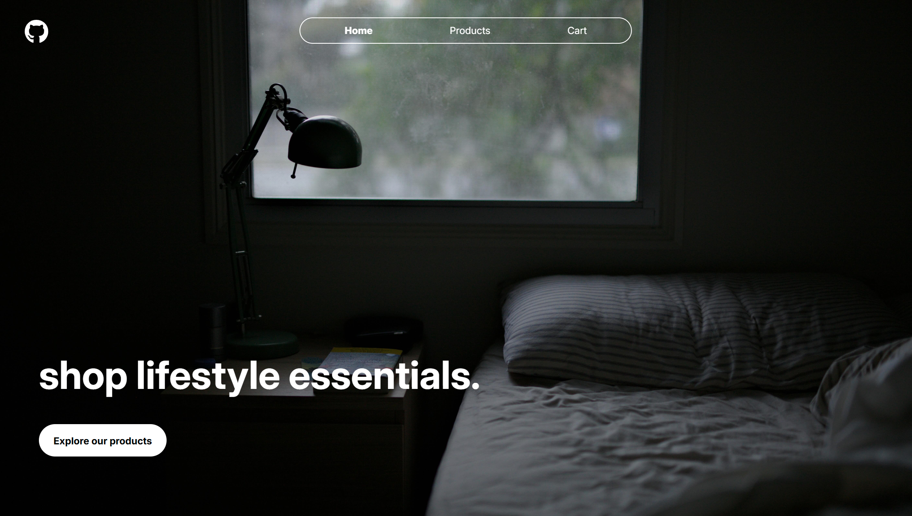
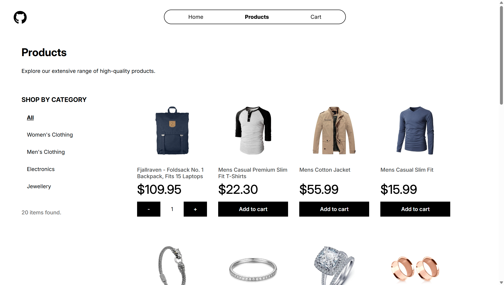
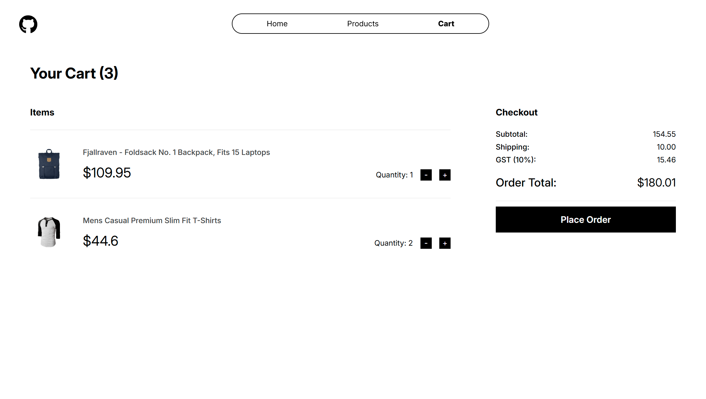

# Shopping Cart

The Odin Project - React Course Project (3/3):

A mock shopping cart built with React Router and the Context API, featuring products from the FakeStore API - tested with Vitest and deployed on Vercel.

## Preview

## Links

Live link: https://shopping-cart-beta-mauve.vercel.app/

Assignment: https://www.theodinproject.com/lessons/node-path-react-new-shopping-cart

## Credits

Homepage image - Alexander Possingham on Unsplash (https://unsplash.com/@allexx54)
